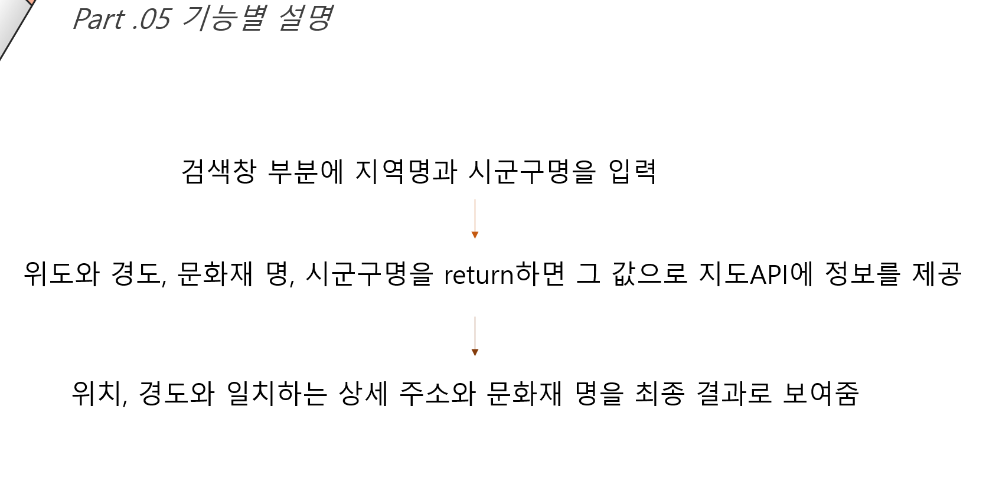

# 위치 기반 문화재 추천 프로그램

문화재청api를 이용해 검색창에 지역을 검색하면 지역 주변 문화재를 지도로 보여주는 프로그램을 만들면서 몰랐던 문화재들을 알 수 있게 만들려고 했습니다. 

또한 가장 간단한 UI로 만들어 다양한 연령층이 쉽게 사용할 수 있도록 만들려고 했습니다. 

완전 초짜일 때 진행했던 프로그램이라 많이 부끄럽지만 성장하는 것도 하나의 과정이라고 생각하고 올립니다ㅎㅎ....😂

## 개발일정

대학교 시절 수업으로 들었던 윈도우즈프로그래밍 수업에서 마지막 프로젝트로 진행했던 프로그램이었습니다.🙂

### 2020.06.27 ~ 2020.06.30

대면만남이 불가능한 상황에서 구글 행아웃으로 회의를 진행했습니다. 

# 어플리케이션 한 줄 소개

## 프로젝트 구조 요약도

# 프로젝트 실행 방법 및 주요 기능

  검색창에 위치를 입력하면 주소창에 가까운 문화재를 보여주는 기능   

### PART 소개

# 기술적인 어려움

윈도우 프로그래밍(C#)에서 마크업 언어르 제공해주는지를 몰라서 조원이었던 분이 지도를 불러 오지 못했습니다.😭

# 느낀점 

처음에는 많이 막막했습니다. 비대면으로 이루어진 수업에서부터 한 번도 시도해 보지 못했던 외부 API를 이용해서 프로그래밍을 해본다는 것이 덜컥 겁부터 먹게 했습니다. 또 조원과도 대면으로 만나지 못하는 상황에서 시간 조율을 하며 카톡과 행아웃으로 비대면으로 만남을 이어갔는데 처음에는 이렇게 만나서 프로젝트가 진행될까 했지만 계획대로 차츰차츰 이루어져 나가는 것을 보고 나름 뿌듯했습니다. 

 또 데이터를 데이터베이스에 넣어야하는지 아니면 url등록 후 파싱으로도 가능한 것인지에 대해서도 감을 잡지 못했는데 교수님께서 보내주신 답변 메일을 통해 조금씩 방향을 잡아 나갈 수 있었습니다. 

 외부 API를 구현하면서 공공데이터에서 제공하는 향토문화정보가 잘 못되어서 인지 데이터베이스에도 .csv파일이 들어가지 않고 공공데이터 페이지에서 제공해주는 미리보기에도 정보가 보이지 않아서 엄청 해맸습니다. 포기하고 싶었지만 그래도 끝까지 프로젝트를 마무리하는 것이 교수님께도 조원인 은영씨를 위해서도 포기하면 안 된다는 생각이 들었습니다. 

 다시 방향성을 잡고 문화재청에서 제공하는 API를 이용해 파싱을 해나가려고 했는데 파싱이 잘 되고 있는지 알아보는 것도 3일이 걸릴 만큼 처음엔 모든 것이 낯설고 어려웠습니다. 

파싱이 잘 되어지고 있다는 것을 확인한 후 Node에 하나하나 접근해 코드를 짜고 있는데 작은 파라미터 오타가 또 에러를 일으켰습니다. 에러가 자꾸 생기면서 어디서 에러가 생기고 있는지 구글링해도 안 나오니까 이게 처음부터 잘못 된건가 하는 생각까지 들었습니다. 하지만 마음을 차분히 하며 코드 하나하나를 읽어 내려와 보니 리턴파라미터의 오타가 있었던 사실을 발견했을 땐 다행이다 싶으면서도 억울하기도 했습니다.

 비대면으로 진행된 강의가 많이 아쉽긴 하지만 그래도 다른 프로그램을 이용해서 조원과 소통하고 문제를 진득하게 생각해보면서 하나하나 풀어나갈 수 있어서 좋았습니다. 조원과 큰 문제없이 소통도 잘 됐었고 얼굴 붉히는 일 없이 서로 협동하여 프로젝트를 수행 할 수 있어서 좋았습니다. 

​    